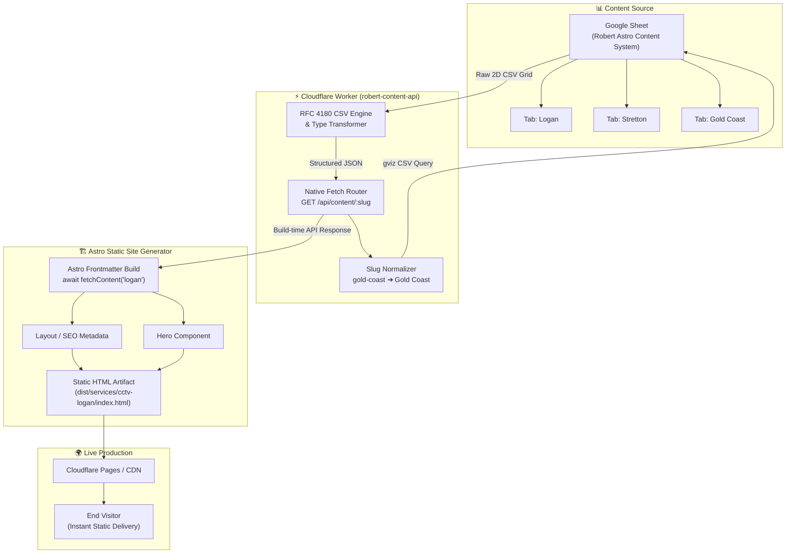

# 🌐 Robert Content API (`robert-content-api`)

[](https://workers.cloudflare.com/)
[](https://www.typescriptlang.org/)
[](LICENSE)
[](#)

> **High-performance, serverless Edge API** built on Cloudflare Workers. It dynamically bridges Google Sheets and **300+ localized Astro static websites** with zero-latency JSON transformations at static build time.

---

## 🚀 Overview

The **Robert Content API** serves as the centralized content engine for a multi-tenant network of localized Astro landing pages. Content editors manage suburb copy directly in **Google Sheets**, while the API dynamically parses, normalizes, and transforms flat sheet rows into structured, strongly-typed JSON for Astro static site generators (`astro build`).

### ✨ Key Features

- ⚡ **Global Edge Latency**: Runs on Cloudflare's global edge network for blazing fast responses.
- 📦 **Zero Runtime Dependencies**: Ultra-lean native TypeScript implementation with zero cold-start overhead.
- 🔄 **Build-Time Fetching (SSG)**: Decoupled architecture where Astro fetches content strictly during static site compilation — live websites serve pure pre-rendered HTML with zero client-side API requests.
- 🛡️ **RFC 4180 Compliant CSV Parser**: Built-in robust parser handling multiline richtext, escaped quotes, and commas.
- 🎯 **Automated Slug-to-Tab Normalization**: Converts clean URL slugs (e.g. `gold-coast`, `logan-central`) into formatted Google Sheet tab names (`Gold Coast`, `Logan Central`).
- 🔒 **Secure by Design**: Encapsulates data sources behind secure environment variables.

---

## 🏗️ Architecture & Data Flow



---

## 📋 Google Sheet Data Schema

Every content tab (e.g. `Logan`, `Stretton`, `Gold Coast`) adheres to the standard 4-column schema:

| Column A (`section_id`) | Column B (`field`) | Column C (`value`) | Column D (`type`) |
| :--- | :--- | :--- | :--- |
| `site` | `suburb` | `Logan` | `text` |
| `site` | `slug` | `logan` | `slug` |
| `hero` | `heading` | `CCTV Security Cameras in Logan` | `text` |
| `hero` | `subheading` | `Professional CCTV Installation` | `text` |
| `hero` | `description` | `Professional CCTV installation for homes and businesses.` | `richtext` |
| `hero` | `bullet_1` | `Professional installation` | `text` |
| `hero` | `bullet_2` | `Mobile viewing` | `text` |
| `hero` | `bullet_3` | `No monthly fees` | `text` |
| `seo` | `title` | `CCTV Security Cameras Logan` | `seo` |
| `seo` | `description` | `Professional CCTV security camera installation in Logan.` | `seo` |

### 🏷️ Supported Type Casts
- `text` / `richtext` / `seo` / `slug`: Preserved as `string`
- `number`: Parsed to `number`
- `boolean`: Cast to `boolean` (`true` / `false`)

---

## 📡 API Contract

### Endpoint
```http
GET /api/content/:slug
```

### Example Request
```bash
curl -X GET "https://robert-content-api.workers.dev/api/content/logan"
```

### ✅ Success Response (`200 OK`)
```json
{
  "status": "success",
  "slug": "logan",
  "content": {
    "site": {
      "suburb": "Logan",
      "slug": "logan"
    },
    "hero": {
      "heading": "CCTV Security Cameras in Logan",
      "subheading": "Professional CCTV Installation",
      "description": "Professional CCTV installation for homes and businesses.",
      "bullet_1": "Professional installation",
      "bullet_2": "Mobile viewing",
      "bullet_3": "No monthly fees"
    },
    "seo": {
      "title": "CCTV Security Cameras Logan",
      "description": "Professional CCTV security camera installation in Logan."
    }
  }
}
```

### ❌ Error Responses

#### `404 Not Found` (Missing or Empty Suburb Tab)
```json
{
  "status": "error",
  "message": "Suburb content not found",
  "slug": "invalid-suburb"
}
```

#### `405 Method Not Allowed`
```json
{
  "status": "error",
  "message": "Method Not Allowed"
}
```

---

## 🛠️ Project Structure

```
robert-content-api/
├── .dev.vars.example           # Local environment variables template
├── .gitignore                  # Git ignore rules (protects .dev.vars & .wrangler)
├── package.json                # Project dependencies and wrangler scripts
├── tsconfig.json               # TypeScript strict configuration
├── wrangler.toml               # Cloudflare Worker deployment configuration
└── src/
    ├── index.ts                # Main entrypoint & native HTTP fetch router
    ├── parser.ts               # RFC 4180 CSV parser & nested JSON transformer
    ├── slug.ts                 # Slug normalization utility (e.g. gold-coast -> Gold Coast)
    ├── types.ts                # TypeScript interfaces and response schemas
    └── test-unit.ts            # Automated unit testing suite
```

---

## 💻 Local Development

### 1. Prerequisites
- **Node.js**: v18+ or v20+ recommended
- **npm** or **pnpm**
- **Cloudflare Wrangler CLI**

### 2. Installation
```bash
# Clone the repository
git clone https://github.com/mamunaio/robert-content-api.git
cd robert-content-api

# Install dependencies
npm install
```

### 3. Environment Configuration
Create a local `.dev.vars` file (this file is excluded from Git):
```bash
cp .dev.vars.example .dev.vars
```

Add your Google Spreadsheet ID in `.dev.vars`:
```env
GOOGLE_SHEET_ID=your_google_spreadsheet_id_here
```
*(Ensure the Google Sheet is shared with "Anyone with the link can view")*

### 4. Run Locally
```bash
# Start Cloudflare Worker local development server
npm run dev
```
The API will be available at: `http://127.0.0.1:8787`

### 5. Run Unit Tests & Typecheck
```bash
# Type check TypeScript files
npm run typecheck

# Run unit tests
npx tsx src/test-unit.ts
```

---

## 🚀 Deployment to Cloudflare Workers

### Deploy via Wrangler
```bash
# Authenticate with Cloudflare
npx wrangler login

# Set production Google Sheet ID secret
npx wrangler secret put GOOGLE_SHEET_ID

# Deploy worker to Cloudflare Edge network
npm run deploy
```

---

## 🔗 Astro Build-Time Integration Example

In your Astro website, consume the API during build time in the page frontmatter:

```astro
---
// src/pages/services/cctv-security-cameras-logan.astro
import CctvLayout from '../../layouts/CctvLayout.astro';
import Hero from '../../components/Hero.astro';
import { fetchContent } from '../../lib/content-client';

const API_BASE_URL = import.meta.env.CONTENT_API_URL || 'http://127.0.0.1:8787';
const data = await fetchContent(API_BASE_URL, 'logan');
const { site, hero, seo } = data.content;
---

<CctvLayout title={seo.title} description={seo.description}>
  <Hero
    heading={hero.heading}
    subheading={hero.subheading}
    description={hero.description}
    bullet1={hero.bullet_1}
    bullet2={hero.bullet_2}
    bullet3={hero.bullet_3}
    suburb={site.suburb}
  />
</CctvLayout>
```

---

## 🛡️ License

This project is licensed under the [MIT License](LICENSE).
